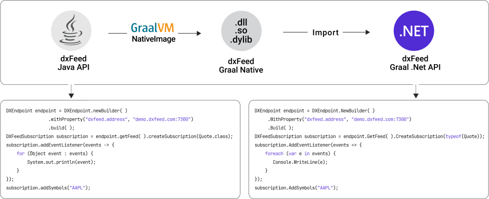

<picture>
 <source media="(prefers-color-scheme: dark)" srcset="docs/images/logo_dark.svg">
 
</picture>

This package provides access to [dxFeed market data](https://dxfeed.com/market-data/).
The library is built as a language-specific wrapper over
the [dxFeed Graal Native](https://dxfeed.jfrog.io/artifactory/maven-open/com/dxfeed/graal-native-api/) library,
which was compiled with [GraalVM Native Image](https://www.graalvm.org/latest/reference-manual/native-image/)
and [dxFeed Java API](https://docs.dxfeed.com/dxfeed/api/overview-summary.html) (our flagman API).

:information_source: If you already use [dxFeed .NET API](https://github.com/dxFeed/dxfeed-net-api), please see
the [Overview](#overview) section.<br>
:warning: It’s an **alpha** version and still under active development. **Don’t use it in a production environment.**

[](https://github.com/dxFeed/dxfeed-graal-net-api/actions/workflows/build.yml)
[](https://dotnet.microsoft.com/en-us/download/dotnet/6.0)

[](https://github.com/dxFeed/dxfeed-graal-net-api/blob/master/LICENSE)
[](https://dxfeed.jfrog.io/artifactory/nuget-open/com/dxfeed/graal-net/)

## Table of Contents

- [Overview](#overview)
    * [Reasons for the New .NET API Repository](#reasons-for-the-new-net-api-repository)
    * [Benefits of the New Version](#benefits-of-the-new-version)
    * [Milestones](#milestones)
    * [Future Development](#future-development)
    * [Migration](#migration)
    * [Implementation Details](#implementation-details)
    * [Architectural Restrictions and Other Limitations in the Old Version](#architectural-restrictions-and-other-limitations-of-the-old-version)
- [Documentation](#documentation)
- [Installation](#installation)
- [Usage](#usage)
- [Samples](#samples)
- [Current State](#current-state)

## Overview

### Reasons for the New .NET API Repository

The [old version](https://github.com/dxFeed/dxfeed-net-api) of dxFeed .NET API is built as a thin wrapper
over [dxFeed C API](https://github.com/dxFeed/dxfeed-c-api),
which has several [architectural restrictions](#architectural-restrictions-and-other-limitations-of-the-old-version)
that
prevent us from providing a state-of-the-art technological solution.

### Benefits of the New Version

- :rocket: Increased performance
- :milky_way: Wider functionality
- :gemini: Identical programming interfaces to our best API
- :thumbsup: Higher quality of support and service

### Milestones

Feature development has already stopped for the [old version](https://github.com/dxFeed/dxfeed-net-api) of dxFeed .NET
API.

We expect the new repository to go into production in Q2’2023.
At the same time, the old version will be considered deprecated, and at the end of 2024, we plan to end the service.
If you’re already our customer and have difficulty with a future transition, please contact us via
our [customer portal](https://jira.in.devexperts.com/servicedesk/customer/portal/1/create/122).

### Future Development

Features planned with **high priority**:

* Add support for missing event
  types:
    * [Profile](https://docs.dxfeed.com/dxfeed/api/com/dxfeed/event/market/Profile.html)
    * [Summary](https://docs.dxfeed.com/dxfeed/api/com/dxfeed/event/market/Summary.html)
    * [Greeks](https://docs.dxfeed.com/dxfeed/api/com/dxfeed/event/option/Greeks.html)
    * [Underlying](https://docs.dxfeed.com/dxfeed/api/com/dxfeed/event/option/Underlying.html)
    * [TheoPrice](https://docs.dxfeed.com/dxfeed/api/com/dxfeed/event/option/TheoPrice.html)
    * [Series](https://docs.dxfeed.com/dxfeed/api/com/dxfeed/event/option/Series.html)
    * [Candle](https://docs.dxfeed.com/dxfeed/api/com/dxfeed/event/candle/Candle.html)
* Add unit tests and conduct different types of testing
* Add necessary entities for more convenient API
  usage ([IPF](https://docs.dxfeed.com/dxfeed/api/com/dxfeed/ipf/InstrumentProfile.html), [TimeSeriesEventModel](https://docs.dxfeed.com/dxfeed/api/com/dxfeed/model/TimeSeriesEventModel.html), [OrderBookModel](https://docs.dxfeed.com/dxfeed/api/com/dxfeed/model/market/OrderBookModel.html), [GetTimeSeriesPromise](https://docs.dxfeed.com/dxfeed/api/com/dxfeed/api/DXFeed.html#getTimeSeriesPromise-java.lang.Class-java.lang.Object-long-long-),
  etc.)
* Provide more samples
* Provide performance test results along with a comparison with the old API version

---
Features planned for the **next stage**:

* Implement a model
  of [incremental updates](https://kb.dxfeed.com/en/data-services/real-time-data-services/-net-api-incremental-updates.html)
  in Java API and add it to .NET API
* Implement OrderBookModel with advanced logic (e.g., OnNewBook, OnBookUpdate, OnBookIncrementalChange) in Java API and
  add it to .NET API
* Add samples or implement a convenient API
  for [Candlewebservice](https://kb.dxfeed.com/en/data-services/aggregated-data-services/candlewebservice.html)

### Migration

To help you rewrite the existing API calls, we’ve prepared [samples](#samples) demonstrating how to work with the new
API and how several functionalities are implemented. More examples will follow. The table below shows the sample mapping
between the old and new versions.

Our support team on our [customer portal](https://jira.in.devexperts.com/servicedesk/customer/portal/1/create/122) is
ready to answer any questions and help with the transition.

#### Sample Mapping

|  #  | Sample                                                                                                                            | Old Version                                                                                                                           | New Version                                                    |
|:---:|:----------------------------------------------------------------------------------------------------------------------------------|:--------------------------------------------------------------------------------------------------------------------------------------|:---------------------------------------------------------------|
|  1  | How to subscribe to `Quote`, `Trade`, `TradeETH`, `Order`, `SpreadOrder`, `AnalyticOrder`, `TimeAndSale` events                   | [dxf_events_sample](https://github.com/dxFeed/dxfeed-net-api/tree/master/samples/dxf_events_sample)                                   | [DxFeed.Graal.Net.Samples.EventsSample](samples/EventSample)   |
|  2  | How to subscribe to `Candle` event                                                                                                | [dxf_candle_sample](https://github.com/dxFeed/dxfeed-net-api/tree/master/samples/dxf_candle_sample)                                   | early *Q1’2023*, please see [TBD](#future-development) section |
|  3  | How to receive IPF data from URL or file                                                                                          | [dxf_instrument_profile_sample](https://github.com/dxFeed/dxfeed-net-api/tree/master/samples/dxf_instrument_profile_sample)           | *Q1’2023*, please see [TBD](#future-development) section       |
|  4  | How to subscribe to IPF live updates                                                                                              | [dxf_instrument_profile_live_sample](https://github.com/dxFeed/dxfeed-net-api/tree/master/samples/dxf_instrument_profile_live_sample) | *Q1’2023*, please see [TBD](#future-development) section       |
|  5  | How to subscribe to `Order`, `SpreadOrder`, `Candle`, `TimeAndSale`, `Greeks`, `Series` snapshots                                 | [dxf_snapshot_sample](https://github.com/dxFeed/dxfeed-net-api/tree/master/samples/dxf_snapshot_sample)                               | *Q1’2023*, please see [TBD](#future-development) section       |
|  6  | How to subscribe to depth of market                                                                                               | [dxf_price_level_book_sample](https://github.com/dxFeed/dxfeed-net-api/tree/master/samples/dxf_price_level_book_sample)               | *Q1’2023*, please see [TBD](#future-development) section       |
|  7  | How to receive snapshots of `TimeAndSale`, `Candle`, `Series`, `Greeks` events on a given time interval without live subscription | [dxf_simple_data_retrieving_sample](https://github.com/dxFeed/dxfeed-net-api/tree/master/samples/dxf_simple_data_retrieving_sample)   | *Q1’2023*, please see [TBD](#future-development) section       |
|  8  | How to subscribe to order snapshot with incremental updates                                                                       | [dxf_inc_order_snapshot_sample](https://github.com/dxFeed/dxfeed-net-api/tree/master/samples/dxf_inc_order_snapshot_sample)           | *Q2’2023*, please see [TBD](#future-development) section       |
|  9  | How to retrieve `Candle` data from the candle web service                                                                         | [dxf_candle_data_retrieving_sample](https://github.com/dxFeed/dxfeed-net-api/tree/master/samples/dxf_candle_data_retrieving_sample)   | *Q2’2023*, please see [TBD](#future-development) section       |
| 10  | How to retrieve `TimeAndSale` data from the candle web service                                                                    | [dxf_tns_data_retrieving_sample](https://github.com/dxFeed/dxfeed-net-api/tree/master/samples/dxf_tns_data_retrieving_sample)         | *Q2’2023*, please see [TBD](#future-development) section       |

### Implementation Details

We use [GraalVM Native Image](https://www.graalvm.org/latest/reference-manual/native-image/) technology and specially
written code that *wraps* Java methods into native ones
to get dynamically linked libraries for different platforms (Linux, macOS, and Windows) based on
the [latest Java API package](https://dxfeed.jfrog.io/artifactory/maven-open/com/devexperts/qd/dxfeed-api/).

Then, the resulting dynamic link library (dxFeed Graal-native) is used through
C [ABI](https://en.wikipedia.org/wiki/Application_binary_interface) (application binary interface),
and we write programming interfaces that describe our business model (similar to Java API).

As a result, we get a full-featured, similar performance as with Java API.
Regardless of the language, writing the final application logic using API calls will be very similar (only the syntax
will be amended, *"best practices"*, specific language restrictions)

Below is a scheme of this process:

<picture>
 <source media="(prefers-color-scheme: dark)" srcset="docs/images/scheme_dark.svg">
 
</picture>

### Architectural Restrictions and Other Limitations of the Old Version

|  #  | Limitation                                                                                                                                                                                                                                                                                                                                   | How It’s Solved in the New Version                                                                                                                                                                                                                                                          |
|:---:|----------------------------------------------------------------------------------------------------------------------------------------------------------------------------------------------------------------------------------------------------------------------------------------------------------------------------------------------|---------------------------------------------------------------------------------------------------------------------------------------------------------------------------------------------------------------------------------------------------------------------------------------------|
|  1  | Windows support only                                                                                                                                                                                                                                                                                                                         | Windows-x64, Linux-x64, macOS-x64, macOS-arm64 support by [.NET 6.0](https://dotnet.microsoft.com/en-us/download/dotnet/6.0).                                                                                                                                                               |
|  2  | Single-threaded architecture limiting throughput                                                                                                                                                                                                                                                                                             | Based on the Java API, each subscription object ([DXFeedSubscription](https://docs.dxfeed.com/dxfeed/api/com/dxfeed/api/DXFeedSubscription.html)) *can* run on its own thread.                                                                                                              |
|  3  | User code in event callbacks (for example, [OnQuote](https://docs.dxfeed.com/net-api/classcom_1_1dxfeed_1_1api_1_1extras_1_1EventPrinter.html#a39bcd590edd9524b64b5fee00d56fccf)) is executed in the socket read thread, which can significantly reduce throughput                                                                           | Socket processing threads and callback threads are separated.                                                                                                                                                                                                                               |
|  4  | In event callbacks, one market event type and one data portion always arrive (excluding snapshot subscription), which increases the load on the CPU with a large amount of incoming data                                                                                                                                                     | Event callbacks can receive different market event types, and more than one by batch.                                                                                                                                                                                                       |
|  5  | It’s impossible to subscribe to data without getting [regionals](https://kb.dxfeed.com/en/data-model/exchange-codes.html) (if it is available for the market event) or only for a certain regional                                                                                                                                           | ```subscription.AddSymbols("AAPL");``` - [composite](https://kb.dxfeed.com/en/data-model/qd-model-of-market-events.html#quote-47603)<br>```subscription.AddSymbols("AAPL&Q");``` - [regional](https://kb.dxfeed.com/en/data-model/qd-model-of-market-events.html#quote-x--regional-quote-). |
|  6  | It’s impossible to subscribe to Order event (excluding snapshot subscription) without getting: all [sources](https://kb.dxfeed.com/en/data-model/qd-model-of-market-events.html#order-x), Order by Quote (including regionals), Order by [MarketMaker](https://kb.dxfeed.com/en/data-model/qd-model-of-market-events.html#marketmaker-47603) | ```subscription.AddSymbols(new IndexedEventSubscriptionSymbol("AAPL", OrderSource.NTV));``` - [Order.Source]() determines which data is being subscribed to.                                                                                                                                |
|  7  | Data is mixed up when creating two subscriptions (regular and time series) for the same market event type. Both regular and time series data go to both subscriptions.                                                                                                                                                                       | Each subscription instance receives only the data requested.                                                                                                                                                                                                                                |
|  8  | Each subsequent request for the same symbol set in a subscription instance overwrites the existing one in another subscription instance.                                                                                                                                                                                                     | Subscription instances and the data they receive are independent of each other.                                                                                                                                                                                                             |
|  9  | Removing a symbol from one subscription instance caused it to be removed from all others.                                                                                                                                                                                                                                                    | Subscription instances and the data they receive are independent of each other.                                                                                                                                                                                                             |
| 10  | Incorrect behavior when reading from a file (if a market event in the file hasn’t been subscribed to). Reading from a file always occurs at maximum speed. The supported format is binary only.                                                                                                                                              | ```endpoint.Connect(@"file:tape.txt[format=text]");``` - processing a text file with at it's "real" speed by timestamps<br>```endpoint.Connect(@"file:tape.bin[format=binary,speed=max]");``` - processing a binary file with max speed.                                                    |

## Documentation

Find useful information in our self-service dxFeed Knowledge Base or .NET API documentation:

- [dxFeed Graal .NET API documentation]()
- [dxFeed Knowledge Base](https://kb.dxfeed.com/index.html?lang=en)
    * [Getting Started](https://kb.dxfeed.com/en/getting-started.html)
    * [Troubleshooting](https://kb.dxfeed.com/en/troubleshooting-guidelines.html)
    * [Market Events](https://kb.dxfeed.com/en/data-model/dxfeed-api-market-events.html)
    * [Event Delivery contracts](https://kb.dxfeed.com/en/data-model/model-of-event-publishing.html#event-delivery-contracts)
    * [dxFeed API Event classes](https://kb.dxfeed.com/en/data-model/model-of-event-publishing.html#dxfeed-api-event-classes)
    * [Exchange Codes](https://kb.dxfeed.com/en/data-model/exchange-codes.html)
    * [Order Sources](https://kb.dxfeed.com/en/data-model/qd-model-of-market-events.html#order-x)
    * [Order Book reconstruction](https://kb.dxfeed.com/en/data-model/dxfeed-order-book/order-book-reconstruction.html)
    * [Symbology Guide](https://kb.dxfeed.com/en/data-model/symbology-guide.html)

## Installation

Add this [package source](https://dxfeed.jfrog.io/artifactory/api/nuget/v3/nuget-open) to NuGet config.
<br/>
For example, you can create a [NuGet.Config file](NuGet.Config) in your solution folder with the following content:

```xml
<?xml version="1.0" encoding="utf-8"?>

<configuration>
    <packageSources>
        <add key="dxFeed" value="https://dxfeed.jfrog.io/artifactory/api/nuget/v3/nuget-open" protocolVersion="3"/>
    </packageSources>
</configuration>
```

Then add the *DxFeed.Graal.Net* package to your project using the NuGet package manager.

## Usage

```csharp
using DxFeed.Graal.Net.Api;
using DxFeed.Graal.Net.Events.Market;

using var endpoint = DXEndpoint.Create().Connect("demo.dxfeed.com:7300");
using var subscription = endpoint.GetFeed().CreateSubscription(typeof(Quote));
subscription.AddEventListener(events =>
{
    foreach (var e in events)
    {
        Console.WriteLine(e);
    }
});
subscription.AddSymbols("AAPL");
Console.ReadKey();
```

<details>
<summary>Output</summary>
<br>

```
I 221219 224811.681 [main] QD - Using QDS-3.313+file-UNKNOWN+mars-UNKNOWN+monitoring-UNKNOWN+tools-UNKNOWN, (C) Devexperts
I 221219 224811.695 [main] QD - Using scheme com.dxfeed.api.impl.DXFeedScheme DH2FdjP0DtOEIOAbE4pRVpmJsPnaZzAo1mICPJ6b06w
I 221219 224812.010 [main] QD - qd with collectors [Ticker, Stream, History]
I 221219 224812.017 [main] ClientSocket-Distributor - Starting ClientSocketConnector to demo.dxfeed.com:7300
I 221219 224812.017 [demo.dxfeed.com:7300-Reader] ClientSocketConnector - Resolving IPs for demo.dxfeed.com
I 221219 224812.021 [demo.dxfeed.com:7300-Reader] ClientSocketConnector - Connecting to 208.93.103.170:7300
I 221219 224812.170 [demo.dxfeed.com:7300-Reader] ClientSocketConnector - Connected to 208.93.103.170:7300
D 221219 224812.319 [demo.dxfeed.com:7300-Reader] QD - Distributor received protocol descriptor multiplexor@WQMPz [type=qtp, version=QDS-3.306, opt=hs, mars.root=mdd.demo-amazon.multiplexor-demo1] sending [TICKER, STREAM, HISTORY, DATA] from 208.93.103.170
Quote{AAPL, eventTime=0, time=20221219-223311.000, timeNanoPart=0, sequence=0, bidTime=20221219-223311, bidExchange=Q, bidPrice=132.16, bidSize=2, askTime=20221219-223311, askExchange=K, askPrice=132.17, askSize=10}
Quote{AAPL, eventTime=0, time=20221219-223312.000, timeNanoPart=0, sequence=0, bidTime=20221219-223312, bidExchange=Q, bidPrice=132.16, bidSize=6, askTime=20221219-223312, askExchange=K, askPrice=132.17, askSize=10}
Quote{AAPL, eventTime=0, time=20221219-223312.000, timeNanoPart=0, sequence=0, bidTime=20221219-223312, bidExchange=K, bidPrice=132.16, bidSize=10, askTime=20221219-223312, askExchange=V, askPrice=132.17, askSize=4}
```

</details>

## Samples

[DxFeed.Graal.Net.Tools](src/DxFeed.Graal.Net.Tools) - the tools allow you to subscribe to various market events for
the
specified symbols.

* [DxFeed.Graal.Net.Samples.EventsSample](samples/EventSample) demonstrates how to subscribe
  to `Quote`, `Trade`, `TradeETH`, `Order`, `SpreadOrder`, `AnalyticOrder`, `TimeAndSale`
  events.
* [DxFeed.Graal.Net.Samples.PrintQuoteEvents](samples/PrintQuoteEvents) a simple demonstration of how to subscribe to
  the `Quote` event.

## Current State

### Event Types

- [x] [Order](https://docs.dxfeed.com/dxfeed/api/com/dxfeed/event/market/Order.html) is a snapshot of the full available
  market depth for a symbol
- [x] [SpreadOrder](https://docs.dxfeed.com/dxfeed/api/com/dxfeed/event/market/SpreadOrder.html) is a snapshot of the
  full available market depth for all spreads
- [x] [AnalyticOrder](https://docs.dxfeed.com/dxfeed/api/com/dxfeed/event/market/AnalyticOrder.html) represents an
  extension of Order introducing analytic information, e.g., adding iceberg-related
  information to this order
- [x] [Trade](https://docs.dxfeed.com/dxfeed/api/com/dxfeed/event/market/Trade.html) is a snapshot of the price and size
  of the last trade during regular trading hours and an overall day
  volume and day turnover
- [x] [TradeETH](https://docs.dxfeed.com/dxfeed/api/com/dxfeed/event/market/TradeETH.html) is a snapshot of the price
  and size of the last trade during extended trading hours and the extended
  trading hours day volume and day turnover
- [ ] [Candle](https://docs.dxfeed.com/dxfeed/api/com/dxfeed/event/candle/Candle.html) - event with open, high, low, and
  close prices and other information for a specific period
- [x] [Quote](https://docs.dxfeed.com/dxfeed/api/com/dxfeed/event/market/Quote.html) is a snapshot of the best bid and
  ask prices and other fields that change with each quote
- [ ] [Profile](https://docs.dxfeed.com/dxfeed/api/com/dxfeed/event/market/Profile.html) is a snapshot that contains the
  security instrument description
- [ ] [Summary](https://docs.dxfeed.com/dxfeed/api/com/dxfeed/event/market/Summary.html) is a snapshot of the trading
  session, including session highs, lows, etc.
- [x] [TimeAndSale](https://docs.dxfeed.com/dxfeed/api/com/dxfeed/event/market/TimeAndSale.html) - represents a trade or
  other market event with price, like market open/close price, etc.
- [ ] [Greeks](https://docs.dxfeed.com/dxfeed/api/com/dxfeed/event/option/Greeks.html) is a snapshot of the option
  price, Black-Scholes volatility, and Greeks
- [ ] [Series](https://docs.dxfeed.com/dxfeed/api/com/dxfeed/event/option/Series.html) is a snapshot of computed values
  available for all options series for a given underlying symbol based on options market prices
- [ ] [TheoPrice](https://docs.dxfeed.com/dxfeed/api/com/dxfeed/event/option/TheoPrice.html) is a snapshot of the
  theoretical option price computation that is periodically performed
  by [dxPrice](http://www.devexperts.com/en/products/price.html) model-free computation
- [ ] [Underlying](https://docs.dxfeed.com/dxfeed/api/com/dxfeed/event/option/Underlying.html) is a snapshot of computed
  values available for an option underlying symbol based on the market’s option prices
- [ ] [Configuration](https://docs.dxfeed.com/dxfeed/api/com/dxfeed/event/misc/Configuration.html) is an event with an
  application-specific attachment
- [ ] [Message](https://docs.dxfeed.com/dxfeed/api/com/dxfeed/event/misc/Message.html) is an event with an
  application-specific attachment

### Subscription Symbols

- [x] String
- [x] [TimeSeriesSubscriptionSymbol](https://docs.dxfeed.com/dxfeed/api/com/dxfeed/api/osub/TimeSeriesSubscriptionSymbol.html) -
  represents subscription to time-series events
- [x] [IndexedSubscriptionSymbol](https://docs.dxfeed.com/dxfeed/api/com/dxfeed/api/osub/IndexedEventSubscriptionSymbol.html) -
  represents subscription to a specific source of indexed events
- [x] [WildcardSymbol.ALL](https://docs.dxfeed.com/dxfeed/api/com/dxfeed/api/osub/WildcardSymbol.html) - represents a
  *wildcard* subscription to all events of the specific event type
- [ ] [CandleSymbol](https://docs.dxfeed.com/dxfeed/api/com/dxfeed/event/candle/CandleSymbol.html) - symbol used
  with [DXFeedSubscription](https://docs.dxfeed.com/dxfeed/api/com/dxfeed/api/DXFeedSubscription.html) class to
  subscribe for [Candle](https://docs.dxfeed.com/dxfeed/api/com/dxfeed/event/candle/Candle.html) events

### Subscriptions & Models

- [x] [CreateSubscription](https://docs.dxfeed.com/dxfeed/api/com/dxfeed/api/DXFeedSubscription.html) creates a new
  subscription for multiple event types *attached* to a specified feed
- [ ] [CreateTimeSeriesSubscription](https://docs.dxfeed.com/dxfeed/api/com/dxfeed/api/DXFeedTimeSeriesSubscription.html)
  extends DXFeedSubscription to conveniently subscribe to time series of events for a set of symbols and event
  types ([Java API sample](https://github.com/devexperts/QD/blob/master/dxfeed-samples/src/main/java/com/dxfeed/sample/api/DXFeedConnect.java))
- [ ] [GetLastEvent](https://docs.dxfeed.com/dxfeed/api/com/dxfeed/api/DXFeed.html#getLastEvent-E-) returns the last
  event for the specified event
  instance ([Java API sample](https://github.com/devexperts/QD/blob/master/dxfeed-samples/src/main/java/com/dxfeed/sample/api/DXFeedSample.java))
- [ ] [GetLastEvents](https://docs.dxfeed.com/dxfeed/api/com/dxfeed/api/DXFeed.html#getLastEvents-java.util.Collection-)
  returns the last events for the specified event instances list
- [ ] [GetLastEventPromise](https://docs.dxfeed.com/dxfeed/api/com/dxfeed/api/DXFeed.html#getLastEventPromise-java.lang.Class-java.lang.Object-)
  requests the last event for the specified event type and
  symbol ([Java API sample](https://github.com/devexperts/QD/blob/master/dxfeed-samples/src/main/java/com/dxfeed/sample/console/LastEventsConsole.java))
- [ ] [GetLastEventsPromises](https://docs.dxfeed.com/dxfeed/api/com/dxfeed/api/DXFeed.html#getLastEventsPromises-java.lang.Class-java.util.Collection-)
  requests the last events for the specified event type and symbol collection
- [ ] [GetLastEventIfSubscribed](https://docs.dxfeed.com/dxfeed/api/com/dxfeed/api/DXFeed.html#getLastEventIfSubscribed-java.lang.Class-java.lang.Object-)
  returns the last event for the specified event type and symbol if there’s a subscription for it
- [ ] [GetIndexedEventsPromise](https://docs.dxfeed.com/dxfeed/api/com/dxfeed/api/DXFeed.html#getIndexedEventsPromise-java.lang.Class-java.lang.Object-com.dxfeed.event.IndexedEventSource-)
  requests an indexed events list for the specified event type, symbol, and source
- [ ] [GetIndexedEventsIfSubscribed](https://docs.dxfeed.com/dxfeed/api/com/dxfeed/api/DXFeed.html#getIndexedEventsIfSubscribed-java.lang.Class-java.lang.Object-com.dxfeed.event.IndexedEventSource-)
  requests an indexed events list for the specified event type, symbol, and source if there’s a subscription for it
- [ ] [GetTimeSeriesPromise](https://docs.dxfeed.com/dxfeed/api/com/dxfeed/api/DXFeed.html#getTimeSeriesPromise-java.lang.Class-java.lang.Object-long-long-)
  requests time series of events for the specified event type, symbol, and time
  range ([Java API sample](https://github.com/devexperts/QD/blob/master/dxfeed-samples/src/main/java/com/dxfeed/sample/_simple_/FetchDailyCandles.java))
- [ ] [GetTimeSeriesIfSubscribed](https://docs.dxfeed.com/dxfeed/api/com/dxfeed/api/DXFeed.html#getTimeSeriesIfSubscribed-java.lang.Class-java.lang.Object-long-long-)
  requests time series of events for the specified event type, symbol, and time range if there’s a subscription for it
- [ ] [TimeSeriesEventModel](https://docs.dxfeed.com/dxfeed/api/com/dxfeed/model/TimeSeriesEventModel.html) - is a model
  of a list of time series
  events ([Java API sample](https://github.com/devexperts/QD/blob/master/dxfeed-samples/src/main/java/com/dxfeed/sample/ui/swing/DXFeedCandleChart.java))
- [ ] [IndexedEventModel](https://docs.dxfeed.com/dxfeed/api/com/dxfeed/model/IndexedEventModel.html) is a model of a
  list of indexed
  events ([Java API sample](https://github.com/devexperts/QD/blob/master/dxfeed-samples/src/main/java/com/dxfeed/sample/ui/swing/DXFeedTimeAndSales.java))
- [ ] [OrderBookModel](https://docs.dxfeed.com/dxfeed/api/com/dxfeed/model/market/OrderBookModel.html) is a model of
  convenient Order Book
  management ([Java API sample](https://github.com/devexperts/QD/blob/master/dxfeed-samples/src/main/java/com/dxfeed/sample/ui/swing/DXFeedMarketDepth.java))

### IPF & Schedule

- [ ] [InstrumentProfile](https://docs.dxfeed.com/dxfeed/api/com/dxfeed/ipf/InstrumentProfile.html) represents basic
  profile information about a market
  instrument ([Java API sample](https://github.com/devexperts/QD/blob/master/dxfeed-samples/src/main/java/com/dxfeed/sample/ipf/DXFeedIpfConnect.java))
- [ ] [InstrumentProfileCollector](https://docs.dxfeed.com/dxfeed/api/com/dxfeed/ipf/live/InstrumentProfileCollector.html)
  collects instrument profile updates and provides the live instrument profiles
  list ([Java API sample](https://github.com/devexperts/QD/blob/master/dxfeed-samples/src/main/java/com/dxfeed/sample/ipf/DXFeedLiveIpfSample.java))
- [ ] [Schedule](https://docs.dxfeed.com/dxfeed/api/com/dxfeed/schedule/Schedule.html) provides API to retrieve and
  explore various exchanges’ trading schedules and different financial instrument
  classes ([Java API sample](https://github.com/devexperts/QD/blob/master/dxfeed-samples/src/main/java/com/dxfeed/sample/schedule/ScheduleSample.java))

### Services

- [ ] [OnDemandService](https://docs.dxfeed.com/dxfeed/api/com/dxfeed/ondemand/OnDemandService.html) provides on-demand
  historical tick data replay
  controls ([Java API sample](https://github.com/devexperts/QD/blob/master/dxfeed-samples/src/main/java/com/dxfeed/sample/ondemand/OnDemandSample.java))

### Endpoint Roles

- [x] [FEED](https://docs.dxfeed.com/dxfeed/api/com/dxfeed/api/DXEndpoint.Role.html#FEED) connects to the remote data
  feed provider and is optimized for real-time or delayed data processing (**this is a default role**)
- [x] [STREAM_FEED](https://docs.dxfeed.com/dxfeed/api/com/dxfeed/api/DXEndpoint.Role.html#STREAM_FEED) is similar to
  FEED and also connects to the remote data feed provider but is designed for bulk data parsing from files
- [ ] [LOCAL_HUB](https://docs.dxfeed.com/dxfeed/api/com/dxfeed/api/DXEndpoint.Role.html#LOCAL_HUB) is a local hub
  without the ability to establish network connections. Events published via publisher are delivered to local feed only.
- [ ] [PUBLISHER](https://docs.dxfeed.com/dxfeed/api/com/dxfeed/api/DXEndpoint.Role.html#PUBLISHER) connects to the
  remote publisher hub (also known as multiplexor) or creates a publisher on the local
  host ([Java API sample](https://github.com/devexperts/QD/blob/master/dxfeed-samples/src/main/java/com/dxfeed/sample/_simple_/WriteTapeFile.java))
- [ ] [STREAM_PUBLISHER](https://docs.dxfeed.com/dxfeed/api/com/dxfeed/api/DXEndpoint.Role.html#STREAM_PUBLISHER) is
  similar to PUBLISHER and also connects to the remote publisher hub, but is designed for bulk data publishing
- [ ] [ON_DEMAND_FEED](https://docs.dxfeed.com/dxfeed/api/com/dxfeed/api/DXEndpoint.Role.html#ON_DEMAND_FEED) is similar
  to FEED, but it is designed to be used with OnDemandService for historical data replay only
