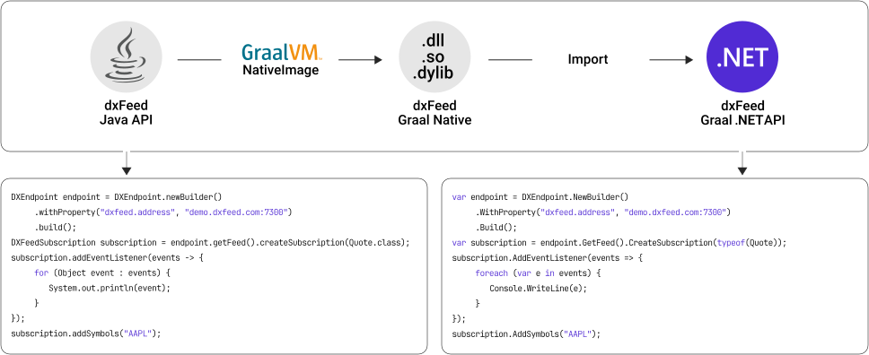

<picture>
 <source media="(prefers-color-scheme: dark)" srcset="docs/images/logo_dark.svg">
 
</picture>

This package provides access to [dxFeed market data](https://dxfeed.com/market-data/).
The library is built as a language-specific wrapper over
the [dxFeed Graal Native](https://dxfeed.jfrog.io/artifactory/maven-open/com/dxfeed/graal-native-api/) library,
which was compiled with [GraalVM Native Image](https://www.graalvm.org/latest/reference-manual/native-image/)
and [dxFeed Java API](https://docs.dxfeed.com/dxfeed/api/overview-summary.html) (our flagman API).

:information_source: If you already use [dxFeed .NET API](https://github.com/dxFeed/dxfeed-net-api), please see
the [Overview](#overview) section.<br>


[](https://dotnet.microsoft.com/en-us/)
[](https://github.com/dxFeed/dxfeed-graal-net-api/releases/latest)
[](https://dxfeed.jfrog.io/artifactory/nuget-open/com/dxfeed/graal-net/)
[](https://github.com/dxFeed/dxfeed-graal-net-api/blob/master/LICENSE)

## Table of Contents

- [Overview](#overview)
    * [Reasons for the New .NET API Repository](#reasons-for-the-new-net-api-repository)
    * [Benefits of the New Version](#benefits-of-the-new-version)
    * [Milestones](#milestones)
    * [Migration](#migration)
    * [Implementation Details](#implementation-details)
    * [Architectural Restrictions and Other Limitations in the Old Version](#architectural-restrictions-and-other-limitations-of-the-old-version)
- [Documentation](#documentation)
- [Requirements](#requirements)
- [Installation](#installation)
- [Usage](#usage)
    * [How to connect to QD endpoint](#how-to-connect-to-qd-endpoint)
    * [How to connect to dxLink](#how-to-connect-to-dxlink)
- [Tools](#tools)
- [Samples](#samples)
- [Current State](#current-state)
- [Dependencies](DEPENDENCIES.md)
- [3rd Party Licenses](THIRD_PARTY_LICENSES.md)

## Overview

### Reasons for the New .NET API Repository

The [old version](https://github.com/dxFeed/dxfeed-net-api) of dxFeed .NET API is built as a thin wrapper
over [dxFeed C API](https://github.com/dxFeed/dxfeed-c-api),
which has several [architectural restrictions](#architectural-restrictions-and-other-limitations-of-the-old-version)
that prevent us from providing a state-of-the-art technological solution.

### Benefits of the New Version

- :rocket: Increased performance
- :milky_way: Wider functionality
- :gemini: Identical programming interfaces to our best API
- :thumbsup: Higher quality of support and service

### Milestones

Feature development has already stopped for the [old version](https://github.com/dxFeed/dxfeed-net-api) of dxFeed .NET
API.

The old version will be considered deprecated, and at the end of 2024, we plan to end the service.
If you’re already our customer and have difficulty with a future transition, please contact us via
our [customer portal](https://jira.in.devexperts.com/servicedesk/customer/portal/1).

### Migration

To help you rewrite the existing API calls, we’ve prepared [samples](#samples) demonstrating how to work with the new
API and how several functionalities are implemented. More examples will follow. The table below shows the sample mapping
between the old and new versions.

Our support team on our [customer portal](https://jira.in.devexperts.com/servicedesk/customer/portal/1) is
ready to answer any questions and help with the transition.

#### Sample Mapping

| # | Sample                                                                                                                            | Old Version                                                                                                                           | New Version                                                       |
|:-:|:----------------------------------------------------------------------------------------------------------------------------------|:--------------------------------------------------------------------------------------------------------------------------------------|:------------------------------------------------------------------|
| 1 | How to get Instrument Profiles                                                                                                    | [dxf_ipf_connect_sample](https://github.com/dxFeed/dxfeed-net-api/tree/master/samples/dxf_ipf_connect_sample)                         | [IpfSample](samples/IPF/IpfSample)                                |
| 2 | How to get live updates for Instrument Profiles                                                                                   | [dxf_instrument_profile_live_sample](https://github.com/dxFeed/dxfeed-net-api/tree/master/samples/dxf_instrument_profile_live_sample) | [IpfLiveSample](samples/IPF/IpfLiveSample)                        |
| 3 | How to subscribe to `Order`, `SpreadOrder`, `Candle`, `TimeAndSale`, `Greeks`, `Series` snapshots                                 | [dxf_snapshot_sample](https://github.com/dxFeed/dxfeed-net-api/tree/master/samples/dxf_snapshot_sample)                               | *Q4’2024*, please see [TBD](#future-development) section          |
| 4 | How to subscribe to depth of market                                                                                               | [dxf_price_level_book_sample](https://github.com/dxFeed/dxfeed-net-api/tree/master/samples/dxf_price_level_book_sample)               | [PriceLevelBookSample](samples/UI/PriceLevelBookSample)           |
| 5 | How to receive snapshots of `TimeAndSale`, `Candle`, `Series`, `Greeks` events on a given time interval without live subscription | [dxf_simple_data_retrieving_sample](https://github.com/dxFeed/dxfeed-net-api/tree/master/samples/dxf_simple_data_retrieving_sample)   | [FetchDailyCandlesSample](samples/Candle/FetchDailyCandlesSample) |
| 6 | How to subscribe to order snapshot with incremental updates                                                                       | [dxf_inc_order_snapshot_sample](https://github.com/dxFeed/dxfeed-net-api/tree/master/samples/dxf_inc_order_snapshot_sample)           | [IncOrderSnapshotSample](samples/Model/IncOrderSnapshotSample)    |
| 7 | How to retrieve `Candle` data from the candle web service                                                                         | [dxf_candle_data_retrieving_sample](https://github.com/dxFeed/dxfeed-net-api/tree/master/samples/dxf_candle_data_retrieving_sample)   | [CandleDataSample](samples/Candle/CandleDataSample)               |                                                                                         |
| 8 | How to retrieve `TimeAndSale` data from the candle web service                                                                    | [dxf_tns_data_retrieving_sample](https://github.com/dxFeed/dxfeed-net-api/tree/master/samples/dxf_tns_data_retrieving_sample)         | [CandleDataSample](samples/Candle/CandleDataSample)               |                                                                                         |

### Implementation Details

We use [GraalVM Native Image](https://www.graalvm.org/latest/reference-manual/native-image/) technology and specially
written code that *wraps* Java methods into native ones
to get dynamically linked libraries for different platforms (Linux, macOS, and Windows) based on
the [latest Java API package](https://dxfeed.jfrog.io/artifactory/maven-open/com/devexperts/qd/dxfeed-api/).

Then, the resulting dynamic link library (dxFeed Graal-native) is used through
C [ABI](https://en.wikipedia.org/wiki/Application_binary_interface) (application binary interface),
and we write programming interfaces that describe our business model (similar to Java API).

As a result, we get a full-featured, similar performance as with Java API.
Regardless of the language, writing the final application logic using API calls will be very similar (only the syntax
will be amended, *"best practices"*, specific language restrictions).

Below is a scheme of this process:

<picture>
 <source media="(prefers-color-scheme: dark)" srcset="docs/images/scheme_dark.svg">
 
</picture>

### Architectural Restrictions and Other Limitations of the Old Version

| #  | Limitation                                                                                                                                                                                                                                                                                                                                   | How It’s Solved in the New Version                                                                                                                                                                                                                                                         |
|:--:|----------------------------------------------------------------------------------------------------------------------------------------------------------------------------------------------------------------------------------------------------------------------------------------------------------------------------------------------|--------------------------------------------------------------------------------------------------------------------------------------------------------------------------------------------------------------------------------------------------------------------------------------------|
| 1  | Windows support only                                                                                                                                                                                                                                                                                                                         | Windows-x64, Linux-x64, macOS-x64, macOS-arm64 support by .NET                                                                                                                                                                                                                             |
| 2  | Single-threaded architecture limiting throughput                                                                                                                                                                                                                                                                                             | Based on the Java API, each subscription object ([DXFeedSubscription](https://docs.dxfeed.com/dxfeed/api/com/dxfeed/api/DXFeedSubscription.html)) *can* run on its own thread                                                                                                              |
| 3  | User code in event callbacks (for example, [OnQuote](https://docs.dxfeed.com/net-api/classcom_1_1dxfeed_1_1api_1_1extras_1_1EventPrinter.html#a39bcd590edd9524b64b5fee00d56fccf)) is executed in the socket read thread, which can significantly reduce throughput                                                                           | Socket processing threads and callback threads are separated                                                                                                                                                                                                                               |
| 4  | In event callbacks, one market event type and one data portion always arrive (excluding snapshot subscription), which increases the load on the CPU with a large amount of incoming data                                                                                                                                                     | Event callbacks can receive different market event types, and more than one by batch                                                                                                                                                                                                       |
| 5  | It’s impossible to subscribe to data without getting [regionals](https://kb.dxfeed.com/en/data-model/exchange-codes.html) (if it is available for the market event) or only for a certain regional                                                                                                                                           | ```subscription.AddSymbols("AAPL");``` - [composite](https://kb.dxfeed.com/en/data-model/qd-model-of-market-events.html#quote-47603)<br>```subscription.AddSymbols("AAPL&Q");``` - [regional](https://kb.dxfeed.com/en/data-model/qd-model-of-market-events.html#quote-x--regional-quote-) |
| 6  | It’s impossible to subscribe to Order event (excluding snapshot subscription) without getting: all [sources](https://kb.dxfeed.com/en/data-model/qd-model-of-market-events.html#order-x), Order by Quote (including regionals), Order by [MarketMaker](https://kb.dxfeed.com/en/data-model/qd-model-of-market-events.html#marketmaker-47603) | ```subscription.AddSymbols(new IndexedEventSubscriptionSymbol("AAPL", OrderSource.NTV));``` - [Order.Source]() determines which data is being subscribed to                                                                                                                                |
| 7  | Data is mixed up when creating two subscriptions (regular and time series) for the same market event type. Both regular and time series data go to both subscriptions                                                                                                                                                                        | Each subscription instance receives only the data requested                                                                                                                                                                                                                                |
| 8  | Each subsequent request for the same symbol set in a subscription instance overwrites the existing one in another subscription instance                                                                                                                                                                                                      | Subscription instances and the data they receive are independent of each other                                                                                                                                                                                                             |
| 9  | Removing a symbol from one subscription instance caused it to be removed from all others                                                                                                                                                                                                                                                     | Subscription instances and the data they receive are independent of each other                                                                                                                                                                                                             |
| 10 | Incorrect behavior when reading from a file (if a market event in the file hasn’t been subscribed to). Reading from a file always occurs at maximum speed. The supported format is binary only                                                                                                                                               | ```endpoint.Connect(@"file:tape.txt[format=text]");``` - processing a text file with at it's "real" speed by timestamps<br>```endpoint.Connect(@"file:tape.bin[format=binary,speed=max]");``` - processing a binary file with max speed                                                    |

## Documentation

Find useful information in our self-service dxFeed Knowledge Base or .NET API documentation:

- [dxFeed Graal .NET API documentation](https://dxfeed.github.io/dxfeed-graal-net-api/)
- [dxFeed Knowledge Base](https://kb.dxfeed.com/index.html?lang=en)
    * [Getting Started](https://kb.dxfeed.com/en/getting-started.html)
    * [Troubleshooting](https://kb.dxfeed.com/en/troubleshooting-guidelines.html)
    * [Market Events](https://kb.dxfeed.com/en/data-model/dxfeed-api-market-events.html)
    * [Event Delivery contracts](https://kb.dxfeed.com/en/data-model/model-of-event-publishing.html#event-delivery-contracts)
    * [dxFeed API Event classes](https://kb.dxfeed.com/en/data-model/model-of-event-publishing.html#dxfeed-api-event-classes)
    * [Exchange Codes](https://kb.dxfeed.com/en/data-model/exchange-codes.html)
    * [Order Sources](https://kb.dxfeed.com/en/data-model/qd-model-of-market-events.html#order-x)
    * [Order Book reconstruction](https://kb.dxfeed.com/en/data-model/dxfeed-order-book/order-book-reconstruction.html)
    * [Symbology Guide](https://kb.dxfeed.com/en/data-model/symbology-guide.html)

## Requirements

### Windows

Only x64 versions are supported.

| OS                                    | Version        | Architectures |
|---------------------------------------|----------------|---------------|
| [Windows][Windows-client]             | 8, 8.1         | x64           |
| [Windows 10][Windows-client]          | Version 1607+  | x64           |
| [Windows 11][Windows-client]          | Version 22000+ | x64           |
| [Windows Server][Windows-Server]      | 2012+          | x64           |
| [Windows Server Core][Windows-Server] | 2012+          | x64           |
| [Nano Server][Nano-Server]            | Version 1809+  | x64           |

#### Requirements

* .NET compatible with .NET Standard 2.0 (not required for self-contained assemblies)
* [Visual C++ Redistributable for Visual Studio 2015][vc_redist]

[Windows-client]: https://www.microsoft.com/windows/

[Windows-Server]: https://learn.microsoft.com/windows-server/

[Nano-Server]: https://learn.microsoft.com/windows-server/get-started/getting-started-with-nano-server

[vc_redist]: https://aka.ms/vs/17/release/vc_redist.x64.exe

### Linux

Only x64 versions are supported.

#### Requirements

* .NET compatible with .NET Standard 2.0 (not required for self-contained assemblies)

#### Libc compatibility

- [glibc][glibc]: 2.17+ (from Oracle Linux 7)
- [musl][musl]: gcompat (glibc compatibility layer) for musl is required. Installation on alpine
  linux `apk update && apk add gcompat libstdc++`

#### Libpthread compatibility

A symlink on libpthread.so, libpthread.so.0, or libcoreclr.so must exist.

[glibc]: https://www.gnu.org/software/libc/

[musl]: https://musl.libc.org/

### macOS

| OS             | Version | Architectures |
|----------------|---------|---------------|
| [macOS][macOS] | 10.15+  | x64           |
| [macOS][macOS] | 11+     | Arm64         |

Is supported in the Rosetta 2 x64 emulator.

[macOS]: https://support.apple.com/macos

#### Requirements

* .NET compatible with .NET Standard 2.0 (not required for self-contained assemblies)

## Installation

Add the following [package source](https://dxfeed.jfrog.io/artifactory/api/nuget/v3/nuget-open)
to your `NuGet.Config` file.

#### For Linux and macOS:

The `NuGet.Config` file is usually located at `~/.config/NuGet/NuGet.Config`.

#### For Windows:

The `NuGet.Config` file is usually located at `%appdata%\NuGet\NuGet.Config`.

An example of what this file might look like:

```xml
<?xml version="1.0" encoding="utf-8"?>
<configuration>
    <packageSources>
        <add key="nuget.org" value="https://api.nuget.org/v3/index.json" protocolVersion="3"/>
        <add key="dxFeed" value="https://dxfeed.jfrog.io/artifactory/api/nuget/v3/nuget-open" protocolVersion="3"/>
    </packageSources>
</configuration>
```

Then add the `DxFeed.Graal.Net` package to your project using the NuGet package manager.

#### Using Visual Studio:

1. Open your solution in Visual Studio.
2. Right-click on the project in `Solution Explorer` and select `Manage NuGet Packages`.
3. Switch to the `Browse` tab, select the dxFeed source, and search for `DxFeed.Graal.Net`.
4. Click `Install` to add the package to your project.

#### Using JetBrains Rider:

1. Open your solution in JetBrains Rider.
2. Right-click on the project in the `Solution` and select `Manage NuGet Packages`.
3. Switch to the `Packages` tab, select the dxFeed source, and search for `DxFeed.Graal.Net`.
4. Right-click on the package and select `Install` to add the package to your project.

> If you are using .NET Framework and building for platform target `AnyCPU`, be sure to uncheck `Prefer 32-bit` in
> `Properties->Build `for the project. We only support 64-bit builds.

#### Using VSCode:

1. Create a new project: `dotnet new console --framework net6.0 --use-program-main`
2. Add the DxFeed.Graal.Net package to your project: `dotnet add package DxFeed.Graal.Net`
3. Copy and paste the following code into the `Program.cs` file:

```csharp
using DxFeed.Graal.Net.Api;
using DxFeed.Graal.Net.Events.Market;

namespace sandbox;

internal abstract class Program
{
    public static async Task Main(string[] args)
    {
        var address = "demo.dxfeed.com:7300";
        var symbol = "AAPL";
        var sub = DXEndpoint.GetInstance().Connect(address).GetFeed().CreateSubscription(typeof(Quote));
        sub.AddEventListener(events =>
        {
            foreach (var quote in events)
            {
                Console.WriteLine(quote);
            }
        });
        sub.AddSymbols(symbol);
        await Task.Delay(Timeout.Infinite);
    }
}
```

4. Run project: `dotnet run`
5. Add C# support to VSCode by following the instructions [here](https://code.visualstudio.com/docs/languages/dotnet)
6. You can now open this directory in VSCode

## Usage

### How to connect to QD endpoint

```csharp
using System;
using DxFeed.Graal.Net.Api;
using DxFeed.Graal.Net.Events.Market;

// For token-based authorization, use the following address format:
// "demo.dxfeed.com:7300[login=entitle:token]"
using var endpoint = DXEndpoint.Create().Connect("demo.dxfeed.com:7300");
using var subscription = endpoint.GetFeed().CreateSubscription(typeof(Quote));
subscription.AddEventListener(events =>
{
    foreach (var e in events)
    {
        Console.WriteLine(e);
    }
});
subscription.AddSymbols("AAPL");
Console.ReadKey();
```

<details>
<summary>Output</summary>
<br>

```
I 231130 141419.914 [main] QD - Using QDS-3.325+file-UNKNOWN, (C) Devexperts
I 231130 141419.925 [main] QD - Using scheme com.dxfeed.api.impl.DXFeedScheme slfwemJduh1J7ibvy9oo8DABTNhNALFQfw0KmE40CMI
I 231130 141419.934 [main] MARS - Started time synchronization tracker using multicast 239.192.51.45:5145 with SFmog
I 231130 141419.937 [main] MARS - Started JVM self-monitoring
I 231130 141419.938 [main] QD - qdnet with collectors [Ticker, Stream, History]
I 231130 141419.950 [main] ClientSocket-Distributor - Starting ClientSocketConnector to demo.dxfeed.com:7300
I 231130 141419.950 [demo.dxfeed.com:7300-Reader] ClientSocketConnector - Resolving IPs for demo.dxfeed.com
I 231130 141419.951 [demo.dxfeed.com:7300-Reader] ClientSocketConnector - Connecting to 208.93.103.170:7300
I 231130 141420.099 [demo.dxfeed.com:7300-Reader] ClientSocketConnector - Connected to 208.93.103.170:7300
D 231130 141420.246 [demo.dxfeed.com:7300-Reader] QD - Distributor received protocol descriptor multiplexor@fFLro [type=qtp, version=QDS-3.319, opt=hs, mars.root=mdd.demo-amazon.multiplexor-demo1] sending [TICKER, STREAM, HISTORY, DATA] from 208.93.103.170
Quote{AAPL, eventTime=0, time=20231130-135604.000+03:00, timeNanoPart=0, sequence=0, bidTime=20231130-135548+03:00, bidExchange=Q, bidPrice=189.43, bidSize=3, askTime=20231130-135604+03:00, askExchange=Q, askPrice=189.49, askSize=1}
```

</details>

### How to connect to dxLink

```csharp
using System;
using DxFeed.Graal.Net;
using DxFeed.Graal.Net.Api;
using DxFeed.Graal.Net.Events.Market;

// Enable experimental feature.
SystemProperty.SetProperty("dxfeed.experimental.dxlink.enable", "true");
// Set scheme for dxLink.
SystemProperty.SetProperty("scheme", "ext:opt:sysprops,resource:dxlink.xml");

// For token-based authorization, use the following address format:
// "dxlink:wss://demo.dxfeed.com/dxlink-ws[login=dxlink:token]"
using var endpoint = DXEndpoint.Create().Connect("dxlink:wss://demo.dxfeed.com/dxlink-ws");
using var subscription = endpoint.GetFeed().CreateSubscription(typeof(Quote));
subscription.AddEventListener(events =>
{
    foreach (var e in events)
    {
        Console.WriteLine(e);
    }
});
subscription.AddSymbols("AAPL");
Console.ReadKey();
```

<details>
<summary>Output</summary>
<br>

```
I 231130 141308.314 [main] QD - Using QDS-3.325+file-UNKNOWN, (C) Devexperts
I 231130 141308.326 [main] QD - Using scheme com.dxfeed.api.impl.DXFeedScheme slfwemJduh1J7ibvy9oo8DABTNhNALFQfw0KmE40CMI
I 231130 141308.351 [main] MARS - Started time synchronization tracker using multicast 239.192.51.45:5145 with DgKtZ
I 231130 141308.358 [main] MARS - Started JVM self-monitoring
I 231130 141308.359 [main] QD - qdnet with collectors [Ticker, Stream, History]
I 231130 141308.384 [main] DxLinkClientWebSocket-Distributor - Starting DxLinkClientWebSocketConnector to wss://demo.dxfeed.com/dxlink-ws
SLF4J: Failed to load class "org.slf4j.impl.StaticLoggerBinder".
SLF4J: Defaulting to no-operation (NOP) logger implementation
SLF4J: See http://www.slf4j.org/codes.html#StaticLoggerBinder for further details.
I 231130 141308.392 [wss://demo.dxfeed.com/dxlink-ws-Writer] DxLinkClientWebSocket-Distributor - Connecting to wss://demo.dxfeed.com/dxlink-ws
I 231130 141308.938 [wss://demo.dxfeed.com/dxlink-ws-Writer] DxLinkClientWebSocket-Distributor - Connected to wss://demo.dxfeed.com/dxlink-ws
D 231130 141310.105 [oioEventLoopGroup-2-1] QD - Distributor received protocol descriptor [type=dxlink, version=0.1-0.18-20231017-133150, keepaliveTimeout=120, acceptKeepaliveTimeout=5] sending [] from wss://demo.dxfeed.com/dxlink-ws
D 231130 141310.106 [oioEventLoopGroup-2-1] QD - Distributor received protocol descriptor [type=dxlink, version=0.1-0.18-20231017-133150, keepaliveTimeout=120, acceptKeepaliveTimeout=5, authentication=] sending [] from wss://demo.dxfeed.com/dxlink-ws
Quote{AAPL, eventTime=0, time=20231130-135604.000+03:00, timeNanoPart=0, sequence=0, bidTime=20231130-135548+03:00, bidExchange=Q, bidPrice=189.43, bidSize=3, askTime=20231130-135604+03:00, askExchange=Q, askPrice=189.49, askSize=1}
```

</details>

To familiarize with the dxLink protocol, please click [here](https://demo.dxfeed.com/dxlink-ws/debug/#/protocol).

## Tools

[Tools](https://github.com/dxFeed/dxfeed-graal-net-api/blob/main/src/DxFeed.Graal.Net.Tools/)
is a collection of utilities that allow you to subscribe to various market events for the specified symbols. The tools
can be downloaded from [Release](https://github.com/dxFeed/dxfeed-graal-net-api/releases)
(including self-contained versions, that do not require .NET installation):

* [Connect](https://github.com/dxFeed/dxfeed-graal-net-api/blob/main/src/DxFeed.Graal.Net.Tools/Connect/ConnectTool.cs)
  connects to the specified address(es) and subscribes to the specified events with the specified symbol
* [Dump](https://github.com/dxFeed/dxfeed-graal-net-api/blob/main/src/DxFeed.Graal.Net.Tools/Dump/DumpTool.cs)
  dumps all events received from address. This was designed to retrieve data from a file
* [PerfTest](https://github.com/dxFeed/dxfeed-graal-net-api/blob/main/src/DxFeed.Graal.Net.Tools/PerfTest/PerfTestTool.cs)
  connects to the specified address(es) and calculates performance counters (events per second, memory usage, CPU usage,
  etc.)
* [LatencyTest](https://github.com/dxFeed/dxfeed-graal-net-api/blob/main/src/DxFeed.Graal.Net.Tools/LatencyTest/LatencyTestTool.cs)
  connects to the specified address(es) and calculates latency
* [Qds](https://github.com/dxFeed/dxfeed-graal-net-api/blob/main/src/DxFeed.Graal.Net.Tools/Qds/QdsTool.cs)
  collection of tools ported from the Java qds-tools

To run tools on macOS, it may be necessary to unquarantine them:

```
sudo /usr/bin/xattr -r -d com.apple.quarantine <directory_with_tools>
```

## Samples

### API

- [x] [AuthSample](samples/API/AuthSample)
  demonstrates how to connect to an endpoint that requires an authentication token,
  subscribe to market data events, and handle periodic token updates
- [x] [ConnectSample](samples/API/ConnectSample)
  demonstrates how to connect to the endpoint and subscribe to various market events
- [x] [PrintQuoteEventsSample](samples/API/PrintQuoteEventsSample)
  demonstrates how to subscribe to the `Quote` event, using a `DxFeed` instance singleton
  and `dxfeed.system.properties` file
- [x] [QuoteAndTradeSample](samples/API/QuoteAndTradeSample)
  demonstrates how to create multiple event listeners and subscribe to `Quote` and `Trade` events
- [x] [ReconnectSample](samples/API/ReconnectSample)
  demonstrates how to connect to an endpoint, subscribe to market data events, handle reconnections
  and re-subscribing

### Candle

- [x] [CandleSample](samples/Candle/CandleSample)
  demonstrates how to subscribe to `Candle` events
- [x] [CandleDataSample](samples/Candle/CandleDataSample)
  demonstrates how to parse response from CandleData service
- [x] [FetchDailyCandlesSample](samples/Candle/FetchDailyCandlesSample)
  demonstrates how to fetch last N-days of candles for a specified symbol

### Console

- [x] [LastEventConsoleSample](samples/Console/LastEventConsoleSample)
  demonstrates how to subscribe to various market events with the dxFeed API, cache them in memory, and
  take snapshots of these events based on user input

### File

- [x] [ConvertTapeFileSample](samples/File/ConvertTapeFileSample)
  demonstrates how to convert one tape file to another tape file with optional intermediate processing or filtering
- [x] [FileParserSample](samples/File/FileParserSample)
  demonstrates how to read events from a tape file
- [x] [WriteTapeFileSample](samples/File/WriteTapeFileSample)
  demonstrates how to write events to a tape file

### IPF

- [x] [IpfSample](samples/IPF/IpfSample)
  demonstrates how to get Instrument Profiles
- [x] [IpfLiveSample](samples/IPF/IpfLiveSample)
  demonstrates how to get live updates for Instrument Profiles
- [x] [OptionChainSample](samples/IPF/OptionChainSample)
  demonstrates how to build option chains, and prints quotes for nearby option strikes

### Model

- [x] [IncOrderSnapshotSample](samples/Model/IncOrderSnapshotSample)
  demonstrates how to subscribe to the Order event and handle snapshots and updates
- [x] [MultipleMarketDepthSample](samples/Model/MultipleMarketDepthSample)
  demonstrates how to use the `MarketDepthModel` to manage and display order books for multiple symbols

### Schedule

- [x] [ScheduleSample](samples/Schedule/ScheduleSample)
  demonstrates how to get various scheduling information for instruments

### UI

- [x] [MarketDepthModelSample](samples/UI/MarketDepthModelSample)
  demonstrates how to draw a Market Depth using Avalonia UI
- [x] [CandleChartSample](samples/UI/CandleChartSample)
  demonstrates how to draw a Candlestick Chart using Avalonia UI
- [x] [PriceLevelBookSample](samples/UI/PriceLevelBookSample)
  demonstrates how to compile a price level book (market by price) that aggregates individual orders
  (market by order)

## Current State

### Endpoint Roles

- [x] [FEED](https://dxfeed.github.io/dxfeed-graal-net-api/docs/api/DxFeed.Graal.Net.Api.DXEndpoint.Role.html#fields)
  connects to the remote data feed provider and is optimized for real-time or delayed data processing,
  this is a default role

- [x] [STREAM_FEED](https://dxfeed.github.io/dxfeed-graal-net-api/docs/api/DxFeed.Graal.Net.Api.DXEndpoint.Role.html#fields)
  is similar to `Feed` and also connects to the remote data feed provider but is designed for bulk data parsing from
  files
  ([DxFeedFileParser](https://github.com/dxFeed/dxfeed-graal-net-api/blob/main/samples/DxFeedFileParser/Program.cs))

- [x] [PUBLISHER](https://dxfeed.github.io/dxfeed-graal-net-api/docs/api/DxFeed.Graal.Net.Api.DXEndpoint.Role.html#fields)
  connects to the remote publisher hub (also known as multiplexor) or creates a publisher on the local host
  ([WriteTapeFile](https://github.com/dxFeed/dxfeed-graal-net-api/blob/main/samples/WriteTapeFile/Program.cs))

- [x] [STREAM_PUBLISHER](https://dxfeed.github.io/dxfeed-graal-net-api/docs/api/DxFeed.Graal.Net.Api.DXEndpoint.Role.html#fields)
  is similar to `Publisher` and also connects to the remote publisher hub, but is designed for bulk data publishing
  ([ConvertTapeFile](https://github.com/dxFeed/dxfeed-graal-net-api/blob/main/samples/ConvertTapeFile/Program.cs))

- [x] [LOCAL_HUB](https://dxfeed.github.io/dxfeed-graal-net-api/docs/api/DxFeed.Graal.Net.Api.DXEndpoint.Role.html#fields)
  is a local hub without the ability to establish network connections. Events published via `Publisher` are delivered to
  local `Feed` only

### Event Types

- [x] [Order](https://dxfeed.github.io/dxfeed-graal-net-api/docs/api/DxFeed.Graal.Net.Events.Market.Order.html)
  is a snapshot of the full available market depth for a symbol

- [x] [SpreadOrder](https://dxfeed.github.io/dxfeed-graal-net-api/docs/api/DxFeed.Graal.Net.Events.Market.SpreadOrder.html)
  is a snapshot of the full available market depth for all spreads

- [x] [AnalyticOrder](https://dxfeed.github.io/dxfeed-graal-net-api/docs/api/DxFeed.Graal.Net.Events.Market.AnalyticOrder.html)
  is an `Order` extension that introduces analytic information, such as adding iceberg-related information to a given
  order

- [x] [Trade](https://dxfeed.github.io/dxfeed-graal-net-api/docs/api/DxFeed.Graal.Net.Events.Market.Trade.html)
  is a snapshot of the price and size of the last trade during regular trading hours and an overall day volume and day
  turnover

- [x] [TradeETH](https://dxfeed.github.io/dxfeed-graal-net-api/docs/api/DxFeed.Graal.Net.Events.Market.TradeETH.html)
  is a snapshot of the price and size of the last trade during extended trading hours and the extended trading hours day
  volume and day turnover

- [x] [Candle](https://dxfeed.github.io/dxfeed-graal-net-api/docs/api/DxFeed.Graal.Net.Events.Candles.Candle.html)
  event with open, high, low, and close prices and other information for a specific period

- [x] [Quote](https://dxfeed.github.io/dxfeed-graal-net-api/docs/api/DxFeed.Graal.Net.Events.Market.Quote.html)
  is a snapshot of the best bid and ask prices and other fields that change with each quote

- [x] [Profile](https://dxfeed.github.io/dxfeed-graal-net-api/docs/api/DxFeed.Graal.Net.Events.Market.Profile.html)
  is a snapshot that contains the security instrument description

- [x] [Summary](https://dxfeed.github.io/dxfeed-graal-net-api/docs/api/DxFeed.Graal.Net.Events.Market.Summary.html)
  is a snapshot of the trading session, including session highs, lows, etc.

- [x] [TimeAndSale](https://dxfeed.github.io/dxfeed-graal-net-api/docs/api/DxFeed.Graal.Net.Events.Market.TimeAndSale.html)
  represents a trade or other market event with price, such as the open/close price of a market, etc.

- [x] [Greeks](https://dxfeed.github.io/dxfeed-graal-net-api/docs/api/DxFeed.Graal.Net.Events.Options.Greeks.html)
  is a snapshot of the option price, Black-Scholes volatility, and greeks

- [x] [Series](https://dxfeed.github.io/dxfeed-graal-net-api/docs/api/DxFeed.Graal.Net.Events.Options.Series.html)
  is a snapshot of computed values available for all options series for a given underlying symbol based on options
  market prices

- [x] [TheoPrice](https://dxfeed.github.io/dxfeed-graal-net-api/docs/api/DxFeed.Graal.Net.Events.Options.TheoPrice.html)
  is a snapshot of the theoretical option price computation that is periodically performed
  by [dxPrice](http://www.devexperts.com/en/products/price.html) model-free computation

- [x] [Underlying](https://dxfeed.github.io/dxfeed-graal-net-api/docs/api/DxFeed.Graal.Net.Events.Options.Underlying.html)
  is a snapshot of computed values available for an option underlying symbol based on the market’s option prices

- [x] [OptionSale](https://dxfeed.github.io/dxfeed-graal-net-api/docs/api/DxFeed.Graal.Net.Events.Market.OptionSale.html)
  represents a trade or another market event with the price (for example, market open/close price, etc.) for each option
  symbol listed under the specified `Underlying`

- [ ] [OtcMarketsOrder](https://docs.dxfeed.com/dxfeed/api/com/dxfeed/event/market/OtcMarketsOrder.html) represents an
  extension of `Order` for the symbols traded on the OTC Markets

### Subscription Symbols

- [x] String is a string representation of the symbol

- [x] [TimeSeriesSubscriptionSymbol](https://dxfeed.github.io/dxfeed-graal-net-api/docs/api/DxFeed.Graal.Net.Api.Osub.TimeSeriesSubscriptionSymbol.html)
  represents subscription to time-series events

- [x] [IndexedEventSubscriptionSymbol](https://dxfeed.github.io/dxfeed-graal-net-api/docs/api/DxFeed.Graal.Net.Api.Osub.IndexedEventSubscriptionSymbol.html)
  represents subscription to a specific source of indexed events

- [x] [WildcardSymbol.ALL](https://dxfeed.github.io/dxfeed-graal-net-api/docs/api/DxFeed.Graal.Net.Api.Osub.WildcardSymbol.html)
  represents a  *wildcard* subscription to all events of the specific event type

- [x] [CandleSymbol](https://dxfeed.github.io/dxfeed-graal-net-api/docs/api/DxFeed.Graal.Net.Events.Candles.CandleSymbol.html)
  is a symbol used
  with [DXFeedSubscription](https://dxfeed.github.io/dxfeed-graal-net-api/docs/api/DxFeed.Graal.Net.Api.DXFeedSubscription.html)
  class to subscribe
  for [Candle](https://dxfeed.github.io/dxfeed-graal-net-api/docs/api/DxFeed.Graal.Net.Events.Candles.Candle.html)
  events

### Subscriptions & Models

- [x] [DXFeedSubscription](https://dxfeed.github.io/dxfeed-graal-net-api/docs/api/DxFeed.Graal.Net.Api.DXFeedSubscription.html)
  is a subscription for a set of symbols and event types

- [x] [GetLastEvent](https://docs.dxfeed.com/dxfeed/api/com/dxfeed/api/DXFeed.html#getLastEvent-E-)
  returns the last event for the specified event instance
- [x] [GetTimeSeriesPromise](https://docs.dxfeed.com/dxfeed/api/com/dxfeed/api/DXFeed.html#getTimeSeriesPromise-java.lang.Class-java.lang.Object-long-long-)
  requests time series events for the specified event type, symbol, and time range

### IPF & Schedule

- [x] [InstrumentProfile](https://dxfeed.github.io/dxfeed-graal-net-api/docs/api/DxFeed.Graal.Net.Ipf.InstrumentProfile.html)
  represents basic profile information about a market instrument

- [x] [InstrumentProfileReader](https://dxfeed.github.io/dxfeed-graal-net-api/docs/api/DxFeed.Graal.Net.Ipf.InstrumentProfileReader.html)
  reads
  instrument profiles from the stream using Instrument Profile Format (IPF)

- [x] [InstrumentProfileCollector](https://dxfeed.github.io/dxfeed-graal-net-api/docs/api/DxFeed.Graal.Net.Ipf.Live.InstrumentProfileCollector.html)
  collects instrument profile updates and provides the live instrument profiles list

- [x] [InstrumentProfileConnection](https://dxfeed.github.io/dxfeed-graal-net-api/docs/api/DxFeed.Graal.Net.Ipf.Live.InstrumentProfileConnection.html)
  connects to an instrument profile URL and reads instrument profiles with support of streaming live updates

- [x] [Schedule](https://docs.dxfeed.com/dxfeed/api/com/dxfeed/schedule/Schedule.html)
  provides an API to retrieving and exploring the trading schedules of various exchanges and different financial
  instrument classes
